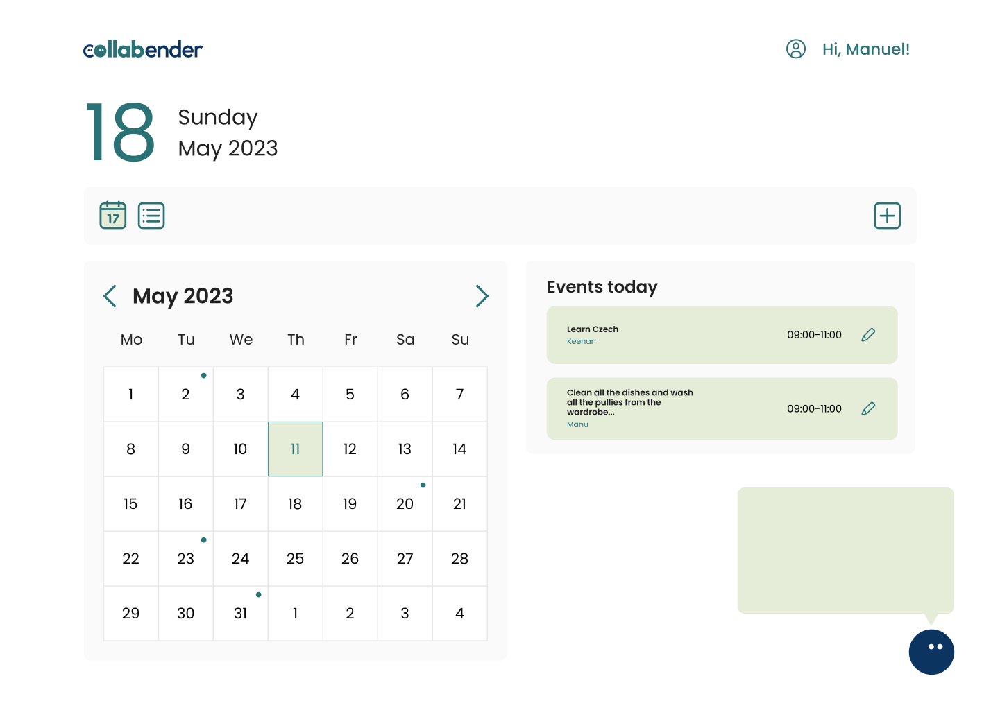

<div align="center">



# 🗓️ Collabender: Calendar App with Qwik and Supabase

See deployment [here](https://qwik-calendar.vercel.app/)

</div>

## 👨🏻‍🎨 Design

Design is to be found [here](https://www.figma.com/design/VUhSBt6jfrSfHVM6pv3yoH/collabender-2023?node-id=6-670&t=HUwJ5JYhGeysJLRP-0).

## 🪜 Next Steps

See [issues](https://github.com/manuelsanchezweb/qwik-calendar/issues).

## ⭐️ How to make the db work

We are using [Turso](https://turso.tech) for the db with [Drizzle (ORM)](https://orm.drizzle.team/).
The first thing we have to do is make sure we have Turso installed in our system, so please check [installation guide](https://docs.turso.tech/quickstart).
Then the steps are the following:

```node
turso auth signup --> login
turso db create <<nameofdb>> --> create a new db close to your location
turso db show <<nameofdb>> --> gives you info about the db
```

In my case I called my db `collabender-dev-db` in local environment.

We need to run now the following command in order to get the authentication token.

```node
turso db tokens create <<nameofdb>>
```

We will store this info in our `.env` like this:

````node
TURSO_CONNECTION_URL=libsql... (you will find this one in the Turso settings of your db)
TURSO_AUTH_TOKEN=<<generatedcode>>
```

You can after that generate a migration to check how it looks like and then run the migration
npx drizzle-kit generate
npx drizzle-kit migrate
````
